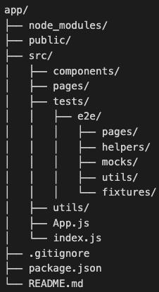

# Suggested TestCafe Folder Structure

;

- **pages/**: Contains files that represent the pages of the application under test, and the selectors and actions that can be performed on those pages. By encapsulating the page elements and their selectors in reusable objects, we can make the tests more modular and easier to read and maintain.
- **helpers/**: Contains files that provide helper functions and utilities that can be used across multiple tests. This can include functions for logging in, setting up test data, or manipulating the DOM.
- **mocks/**: Contains files that define mock data or mock APIs that can be used in the tests. By using mock data or APIs, we can isolate the tests from external dependencies and make them more reliable and deterministic.
- **utils/**: Contains files that provide utility functions or constants that can be used across multiple tests or files. This can include functions for generating random data, formatting dates, or handling errors.
- **fixtures/**: Contains files that group related tests together, along with the setup and cleanup logic that runs before and after each test. By organizing the tests into fixtures, we can reduce code duplication and improve the readability and maintainability of the tests.
